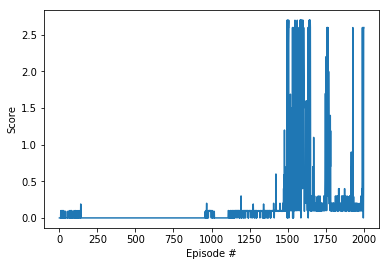

# Collaboration and Competition project report

## Learning Algorithm

I used the [DDPG code from project 2](https://github.com/da1ssk/Udacity-DRLND-2-Continuous-Control/blob/main/ddpg_agent.py) as the base.

The actor and critic models are common for both agents. Experience from each agent is added to the replay buffer for each step.

I needed to perform random actions before acting based on the policy. Otherwise learning never happened and the max score is always 0.0. The random actions are performed for the first 1400 steps which are roughly equal to 100 episodes.

### Agent ([`ddpg_agent.py`](ddpg_agent.py))
The changes I made were its hyperparameters, and the sigma of the OUNoise as suggested [here](https://knowledge.udacity.com/questions/210686). Interestingly, as soon as I changed the sigma to 0.1, the learning got much better.

**Hyperparameters**
- `BUFFER_SIZE` = int(1e6)  # replay buffer size
- `BATCH_SIZE` = 256        # minibatch size (previously 64)
- `GAMMA` = 0.99            # discount factor
- `TAU` = 1e-3              # for soft update of target parameters
- `LR_ACTOR` = 1e-4         # learning rate of the actor 
- `LR_CRITIC` = 1e-3        # learning rate of the critic (previously 1e-4)
- `WEIGHT_DECAY` = 0.0      # L2 weight decay
- `LEARN_EVERY` = 2         # frequency to learn (previously 10)

**OUNoise**
- `sigma=0.1`

### Model architecture ([`model.py`](model.py))
I use the same `Actor` and the `Critic` class from project 2.

Detailed info is described [here](https://github.com/da1ssk/Udacity-DRLND-2-Continuous-Control/blob/main/Report.md#model-architecture-modelpy).

## Plot of Rewards
Here are the latest average scores for every 100 episodes. 

```
Episode 100	Average Score: 0.0165
Episode 200	Average Score: 0.0143
Episode 300	Average Score: 0.0000
Episode 400	Average Score: 0.0000
Episode 500	Average Score: 0.0000
Episode 600	Average Score: 0.0000
Episode 700	Average Score: 0.0000
Episode 800	Average Score: 0.0000
Episode 900	Average Score: 0.0000
Episode 1000	Average Score: 0.0287
Episode 1100	Average Score: 0.0066
Episode 1200	Average Score: 0.0584
Episode 1300	Average Score: 0.0837
Episode 1400	Average Score: 0.0826
Episode 1500	Average Score: 0.2587
Episode 1600	Average Score: 1.1669
Episode 1700	Average Score: 0.7008
Episode 1800	Average Score: 0.4476
Episode 1900	Average Score: 0.1601
Episode 2000	Average Score: 0.3296
```

Here is the plot of rewards over episodes.



It took 1600 episodes to pass the criteria. However, the rewards decreased below 0.5 after that.

The learned weights for the networks are found [here](checkpoint_actor.pth) (actor) and [here](checkpoint_critic.pth) (critic).

## Using the learned weight for visualization
I visualized the agent by loading the learned actor's weight (`checkpoint_actor.pth`).


## Ideas for Future Work
It is impressive to see the agents keep rallying for a significant period.

The only thing I would like to improve is the speed of learning. It started getting rewards only after 1000 episodes. While learning with GPU is quick, it would be good to make it fewer episodes to run.

I noticed that the agents' behaviors move far forward after they hit the ball. It feels inefficient energy-wise even if that's the best strategy to pick the ball. We could probably penalize the excessive movement by introducing some error terms and further optimize the agent's movement.

It would be also interesting to apply the same technique to the Soccor environment and see how it works.
